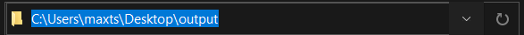

# SysEngSkillsTest

### How To Compile

- cd into folder containg main.java (code/src)
- javac main.java

### How To Run

- after compiling, you should have a main.class file
- main takes two arguments, and the ordering is essential
1. Absoulte Path to input folder (contains all png and xml files)
2. Absolute path to output folder (where output of annotated pngs should be saved to)
- java main {input path} {output path}

I would recommend grabbing the absolute path from file explorer like so:

